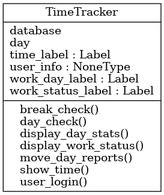
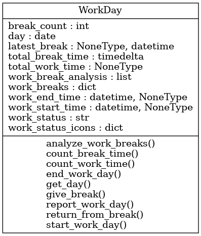
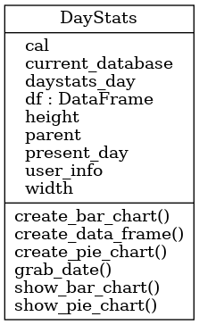
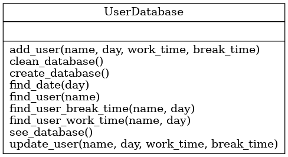

.. Work Time Tracker documentation master file, created by
   sphinx-quickstart on Thu Apr 13 11:14:18 2023.
   You can adapt this file completely to your liking, but it should at least
   contain the root `toctree` directive.

Welcome to Work Time Tracker's documentation!
=============================================

.. toctree::
   :maxdepth: 2
   :caption: Contents:

.. automodule:: src.time_tracking_OOP.time_tracker
   :members:

.. automodule:: src.time_tracking_OOP.work_day
   :members:

.. automodule:: src.time_tracking_OOP.day_stats
   :members: 

.. automodule:: src.time_tracking_OOP.userdatabase
   :members:

UML Class Diagrams
==================

Indices and tables
==================

* :ref:`genindex`
* :ref:`modindex`
* :ref:`search`
